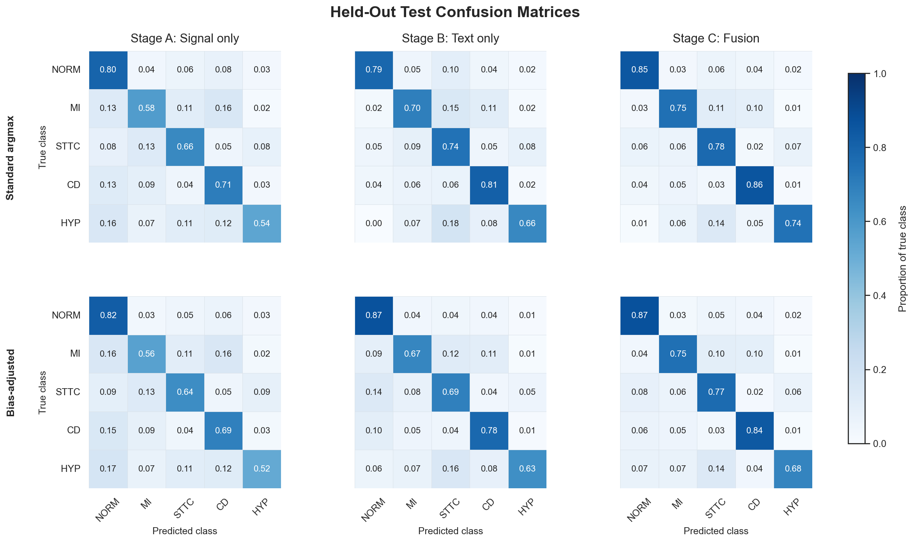

# Multimodal ECG-Clinical Text Transformer for Diagnostic Classification

A multimodal transformer that fuses 12-lead ECG waveforms with cardiologist report text
to perform 5-class cardiac diagnostic classification on PTB-XL.

> **Status:** Core model development and held-out evaluation are complete. Export, serving, containerization, benchmarking, and final documentation remain in progress.

## Overview

This project implements a modular multimodal deep learning pipeline for ECG diagnostic
classification and evaluates the individual and combined contributions of biosignal and
clinical text representations. Three model variants are trained and evaluated:

- **Stage A:** ECG signal only (CNN stem + transformer encoder)
- **Stage B:** Cardiologist report text only (LoRA-adapted MedBERT.de encoder)
- **Stage C:** Late fusion of both modalities via cross-attention

The remaining work extends the completed training and evaluation pipeline with ONNX export and quantization, latency and memory benchmarking, FastAPI serving, Docker containerization, and GitHub Actions CI.

## Dataset

[PTB-XL](https://physionet.org/content/ptb-xl/1.0.3/) contains 21,799 clinical 12-lead ECG
recordings from a German hospital, each paired with a cardiologist-written report in German.
Open access, no application required.

## Classification Results

The final checkpoints were selected using validation performance only, and fold 10 was then evaluated once. Standard argmax metrics are the primary comparison. A validation-fitted logit-bias analysis is reported separately below.

| Model | Input | Macro F1 | Macro AUC |
|---|---|---:|---:|
| Stage A | ECG | 0.645 | 0.904 |
| Stage B | Text | 0.714 | 0.938 |
| Stage C | ECG + text | **0.774** | **0.952** |

Fusion improved macro F1 by 0.129 over the signal model and 0.060 over the text model. Macro AUC increased by 0.048 and 0.015, respectively. Stage C showed the smallest validation-to-test macro-F1 decline: 0.009, compared with 0.020 for Stage A and 0.027 for Stage B.

### Class-level results

Stage C achieved the highest F1 for every class: NORM 0.894, MI 0.770, STTC 0.727, CD 0.812, and HYP 0.669. Its largest gains over Stage A were on HYP (+0.178), MI (+0.161), and CD (+0.161).

STTC provides the clearest evidence of complementary modality use. The text model slightly underperformed the signal model on this class (0.641 versus 0.652), while fusion improved F1 to 0.727. HYP remained the weakest and least represented class, with 109 test examples, but fusion substantially improved it over both unimodal models.

Stage B confused NORM with STTC more often than Stage A: 10.0% versus 5.6% of true NORM cases. Stage C reduced this rate to 5.8%, consistent with the signal branch mitigating an error pattern present in the text-only model.

Stage C corrected 340 of Stage A's 602 errors and 176 of Stage B's 495 errors. On examples where Stage A confidence was below 0.50, accuracy increased from 0.465 to 0.711 with fusion. For the equivalent Stage B subset, accuracy increased from 0.328 to 0.679.

<p align="center">
  
</p>

### Confidence behavior

Accuracy increased monotonically with softmax confidence for all three models. In the 0.95–1.00 bin, accuracy reached 96.2% for Stage A, 94.8% for Stage B, and 99.6% for Stage C. Stage C was also especially reliable in the 0.85–0.95 bin, reaching 97.6% accuracy across 616 examples. The largest mismatch between confidence and empirical accuracy appeared in Stage B's 0.70–0.85 bin, where accuracy was 50.0%. Overall, confidence remained informative across the three models, with Stage C showing the strongest behavior at high confidence. These bins describe confidence behavior rather than formal probability calibration.

### Validation-fitted logit bias

Validation-fitted bias adjustment did not generalize consistently. It reduced Stage A macro F1 from 0.645 to 0.641, improved Stage B from 0.714 to 0.729, and was effectively neutral for Stage C (0.774 to 0.775). Class-level effects were also inconsistent: HYP improved for Stage B but declined for Stages A and C. Because HYP contains only 109 test examples, this result should be interpreted cautiously. Standard argmax metrics therefore remain primary, while the fitted bias is retained as a secondary decision-rule analysis.

### Modality dropout and text ablation
 
Stage B (text only) achieved higher aggregate macro F1 and AUC than Stage A (signal only), which creates a risk that the fusion model learns to rely primarily on text and treats the signal branch as a minor contributor. To test for and counter this, the final fusion configuration was trained both with and without text modality dropout (p=0.3) across four seeds, and each checkpoint was evaluated on validation data twice: once with both modalities present, and once with text deterministically masked (text ablation).
 
Full-modality performance, both ECG and text provided at inference, was nearly identical with and without dropout training: mean macro F1 across the four seeds was 0.782 without dropout and 0.784 with dropout. Under text ablation, the model trained without modality dropout showed a mean macro-F1 drop of 0.204 and a mean macro-AUC drop of 0.067. Modality dropout reduced these to 0.133 (a 34.9% reduction) and 0.045 (32.4%). It also narrowed the seed-to-seed spread of the F1 drop substantially, from 0.195 to 0.012, meaning robustness to missing text became more consistent across seeds rather than dependent on which seed was used.
 
This ablation models a deployment scenario in which report text is delayed or unavailable at inference time. Modality dropout gives the fusion model a stable signal-only fallback while preserving the benefit of report text when it is present, making missing-text robustness an explicit design requirement rather than only an academic exercise.

### Context against published PTB-XL results

Stage A achieved a test macro AUC of 0.904 using supervised training on PTB-XL without external pretraining. For context, large-scale pretrained models such as [MERL](https://arxiv.org/abs/2403.06659) and [D-BETA](https://proceedings.mlr.press/v267/pham-hung25a.html) report full-label PTBXL-Super linear-probe AUCs of 0.887 and 0.901, respectively. Both methods use paired ECG and report text during pretraining, but their linear-probe evaluations measure the learned ECG representation without requiring report text at inference. Stage A is therefore the closest model in this project for contextual comparison. These results provide context rather than a direct ranking because MERL and D-BETA evaluate the standard multilabel superclass task, whereas this project assigns one dominant superclass to each record.

## Scope and Limitations

- The task assigns one dominant diagnostic superclass to each record, so results are not directly comparable with standard multilabel PTB-XL benchmarks.
- Stages B and C use cardiologist report text and should be interpreted as report-informed classification rather than diagnosis from ECG evidence alone.
- Evaluation is retrospective and limited to PTB-XL. The deployment stack demonstrates production-oriented ML engineering, but the model is 
not clinically validated or intended for patient care.

## Setup

```bash
python -m venv .venv && source .venv/bin/activate
pip install -e ".[dev]"
```

## Collaboration and Contributions

This repository is maintained as an independent ML engineering project. Collaboration on reproducibility studies, multimodal modeling, evaluation, and deployment-oriented extensions is welcome.

For substantial changes, please open an issue describing the proposed contribution before submitting a pull request.