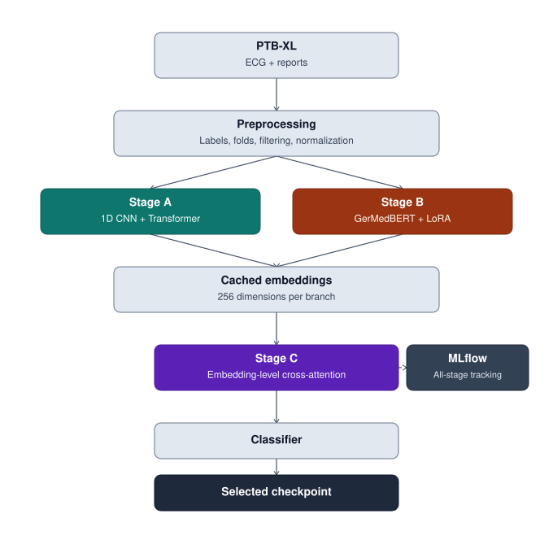
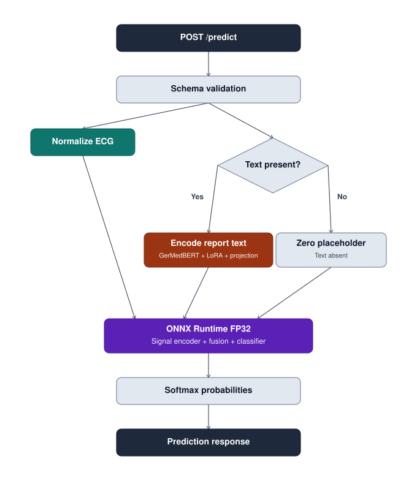
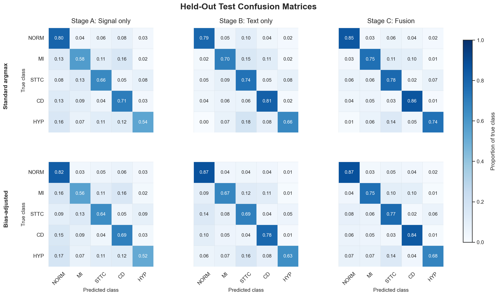
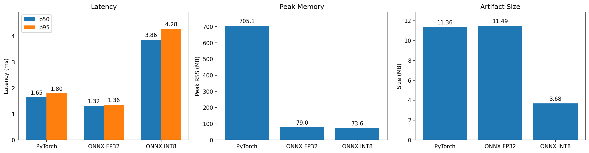

# Multimodal ECG-Clinical Text Transformer for Diagnostic Classification

[](https://github.com/hhafizi24/multimodal-ecg-text-transformer/actions/workflows/ci.yml)

An end-to-end multimodal ML system that combines 12-lead ECG waveforms with
clinical report text for five-class, report-informed classification on PTB-XL.

| Test macro F1 | Test macro AUC | FP32 ONNX p95 | API p95 |
|---:|---:|---:|---:|
| **0.774** | **0.952** | **1.36 ms** model-only | **50.24 ms** with text<br>**7.35 ms** without text |

## Overview

This project evaluates whether ECG waveforms and clinical report text provide
complementary information for cardiac classification. Three model variants
isolate the contribution of each modality and their combination:

- **Stage A:** ECG signal only (CNN stem + Transformer encoder)
- **Stage B:** Clinical report text only (LoRA-adapted GerMedBERT encoder)
- **Stage C:** Late fusion of both modalities via cross-attention

The selected fusion model is exported to ONNX and served through FastAPI with
optional report text. The repository also includes Hydra-Zen training presets,
MLflow experiment tracking, runtime benchmarks, Docker packaging, and GitHub
Actions CI.

## Architecture

Stage C uses late embedding-level cross-attention between the ECG representation
and the projected output of a LoRA-adapted GerMedBERT encoder. The signal
embedding acts as the query over the paired signal and text embeddings. The
selected Stage A and Stage B encoders are frozen, and their 256-dimensional
representations are cached during fusion training.

<table>
  <thead>
    <tr>
      <th align="center">
        <h3>Offline training and model selection</h3>
      </th>
      <th align="center">
        <h3>Request-time inference</h3>
      </th>
    </tr>
  </thead>
  <tbody>
    <tr>
      <td align="center" valign="top">
        
      </td>
      <td align="center" valign="top">
        
      </td>
    </tr>
  </tbody>
</table>

The ONNX graph contains the signal encoder, fusion module, and classifier. The
language model remains outside the graph so projected report embeddings can be
computed independently and reused when appropriate. When report text is absent,
the availability mask excludes the text position and activates the
signal-only fallback learned through modality dropout.

The serving application is packaged in Docker. GitHub Actions runs the portable
test suite on pushes and pull requests to `main`; neither system is part of the
request data path shown above.

## Dataset and Task

[PTB-XL v1.0.3](https://physionet.org/content/ptb-xl/1.0.3/) contains
21,799 ten-second, 12-lead ECG recordings from 18,869 patients, with paired
German-language report text and standardized SCP-ECG annotations. It is openly
available from PhysioNet under CC BY 4.0. The dataset provides waveforms at
500 Hz and a downsampled 100 Hz version; this project uses the 100 Hz records,
giving an input shape of 1,000 samples by 12 leads.

PTB-XL is natively multilabel. This project defines a controlled single-label
task by aggregating each record's diagnostic SCP-code likelihoods into five
superclasses and retaining the dominant class only when it accounts for at
least 50% of the diagnostic score. Records without a valid or sufficiently
dominant class are excluded.

| Label | Diagnostic superclass |
|:---|:---|
| NORM | Normal ECG |
| MI | Myocardial infarction |
| STTC | ST/T change |
| CD | Conduction disturbance |
| HYP | Hypertrophy |

## Preprocessing

| Step | Implementation |
|:---|:---|
| Split strategy | Official PTB-XL folds 1-8 for training, fold 9 for validation, and fold 10 for the final test evaluation |
| Signal loading | 100 Hz WFDB records with required shape `[1000, 12]` |
| Filtering | Fourth-order Butterworth band-pass filter from 0.5 to 40 Hz, applied with zero-phase second-order-section filtering |
| Normalization | Per-lead mean and standard deviation fitted on the training split only, then applied unchanged to validation, test, and serving inputs |
| Text | Report strings retained in UTF-8; tokenization is performed by the text dataloader or serving pipeline with a maximum length of 128 tokens |
| Reproducibility | Split arrays, ECG identifiers, training-derived class weights, normalization statistics, and the preprocessing configuration are saved alongside the processed data |

The zero-phase filter matches the offline training pipeline and requires a
complete ten-second window. A real-time streaming implementation would require
a causal, stateful filter using the same coefficients.

## Experimental Design

The models were trained sequentially so each modality had an independently
selected baseline before fusion. Hyperparameters and checkpoints were selected
using validation fold 9 only. Test fold 10 remained untouched until the final
evaluation.

| Stage | Purpose | Selected configuration | Optimization |
|:---|:---|:---|:---|
| **A: Signal only** | Establish the ECG baseline | Five-block 1D CNN with average pooling, followed by a three-layer Transformer encoder and 256-dimensional classifier | End-to-end training with class-weighted focal loss, gamma 1.5 |
| **B: Text only** | Measure the information available in the unmodified report text | GerMedBERT with rank-4 LoRA on the query and value projections, plus a 256-dimensional projection and classifier | LoRA, projection, and classification layers trained with class-weighted cross-entropy |
| **C: Fusion** | Test whether the two modalities provide complementary information | Frozen Stage A and Stage B encoders, cached 256-dimensional embeddings, and 16-head embedding-level cross-attention | Fusion and classification layers trained with class-weighted focal loss, gamma 1.5, and text modality dropout at 0.3 |

Training used early stopping and cosine learning-rate scheduling. MLflow tracked
run configurations, metrics, checkpoints, and artifacts. The selected
Hydra-Zen configurations are committed as resolved YAML files in
[`configs/selected`](configs/selected/).

## Final Results

After validation-only model selection, each checkpoint was evaluated once on
test fold 10. Standard argmax metrics are the primary comparison. A
validation-fitted logit-bias analysis is reported separately below.

| Model | Input | Macro F1 | Macro AUC |
|---|---|---:|---:|
| Stage A | ECG | 0.645 | 0.904 |
| Stage B | Text | 0.714 | 0.938 |
| Stage C | ECG + text | **0.774** | **0.952** |

Fusion improved macro F1 by 0.129 over the signal model and 0.060 over the text
model. Macro AUC increased by 0.048 and 0.015, respectively. Stage C also
showed the smallest validation-to-test macro-F1 decline: 0.009, compared with
0.020 for Stage A and 0.027 for Stage B.

### Per-class performance

| Model | NORM | MI | STTC | CD | HYP |
|:---|---:|---:|---:|---:|---:|
| Stage A | 0.822 | 0.609 | 0.652 | 0.651 | 0.492 |
| Stage B | 0.861 | 0.703 | 0.641 | 0.768 | 0.600 |
| Stage C | **0.894** | **0.770** | **0.727** | **0.812** | **0.669** |

Stage C achieved the highest F1 for every class. Its largest gains over Stage A
were on HYP (+0.178), MI (+0.161), and CD (+0.161). STTC provides the clearest
example of complementary modality use: Stage B slightly underperformed Stage A
on this class (0.641 versus 0.652), while fusion improved F1 to 0.727. HYP
remained the weakest and least represented class, with 109 test examples.

<p align="center">
  
</p>

### Failure analysis

- **Class confusion:** Stage B misclassified 10.0% of NORM examples as STTC,
  compared with 5.6% for Stage A. Stage C lowered the Stage B rate to 5.8%,
  nearly matching the signal-only baseline and suggesting that the signal
  branch mitigated this text-only error pattern. The most frequent Stage C
  errors were NORM to STTC (54 examples), MI to STTC (40), and NORM to CD (39).
  HYP was most often confused with STTC (14% of HYP examples).
- **Error recovery:** Stage C corrected 340 of Stage A's 602 errors and 176 of
  Stage B's 495 errors. It also changed 118 correct Stage A predictions and 61
  correct Stage B predictions to errors, producing net gains of 222 and 115
  correct examples, respectively.
- **Low-confidence cases:** On examples where Stage A confidence was below 0.50,
  accuracy increased from 0.465 to 0.711 with fusion. For the equivalent Stage B
  subset, accuracy increased from 0.328 to 0.679.
- **Confidence behavior:** Accuracy increased monotonically with confidence for
  all three models. Stage C reached 97.6% accuracy in the 0.85–0.95 bin and
  99.6% in the 0.95–1.00 bin. The main exception was Stage B's 0.70–0.85 bin,
  where accuracy was 50.0%. These bins describe confidence behavior rather than
  formal probability calibration.

### Validation-fitted logit bias

Validation-fitted bias adjustment did not generalize consistently. It reduced
Stage A macro F1 from 0.645 to 0.641, improved Stage B from 0.714 to 0.729, and
was effectively neutral for Stage C (0.774 to 0.775). Class-level effects were
also inconsistent: HYP improved for Stage B but declined for Stages A and C.
Because HYP contains only 109 test examples, this result should be interpreted
cautiously. Standard argmax metrics therefore remain primary, while the fitted
bias is retained as a secondary decision-rule analysis.

### Modality dropout and text ablation

Stage B (text only) achieved higher aggregate macro F1 and AUC than Stage A (signal only), which creates a risk that the fusion model learns to rely primarily on text and treats the signal branch as a minor contributor. To test for and counter this, the final fusion configuration was trained both with and without text modality dropout (p=0.3) across four seeds, and each checkpoint was evaluated on validation data twice: once with both modalities present, and once with text deterministically masked (text ablation).

Full-modality performance, both ECG and text provided at inference, was nearly identical with and without dropout training: mean macro F1 across the four seeds was 0.782 without dropout and 0.784 with dropout. Under text ablation, the model trained without modality dropout showed a mean macro-F1 drop of 0.204 and a mean macro-AUC drop of 0.067. The model trained with modality dropout minimized this effect, with a mean macro-F1 drop of only 0.133 (a 34.9% reduction) and a mean macro-AUC drop of only 0.045 (32.4%). It also narrowed the seed-to-seed spread of the F1 drop substantially, from 0.195 to 0.012, meaning robustness to missing text became more consistent across seeds rather than dependent on which seed was used.

This ablation models an inference scenario in which report text is delayed or unavailable. Modality dropout gives the fusion model a more stable signal-only fallback while preserving the benefit of report text when it is present. The results highlight how a multimodal model can become overly dependent on one input, making that dependence a practical deployment consideration rather than only an academic concern.

### Context against published PTB-XL results

Stage A achieved a test macro AUC of 0.904 using supervised training on PTB-XL without external pretraining. For context, large-scale pretrained models such as [MERL](https://arxiv.org/abs/2403.06659) and [D-BETA](https://proceedings.mlr.press/v267/pham-hung25a.html) report full-label PTBXL-Super linear-probe AUCs of 0.887 and 0.901, respectively. Both methods use paired ECG and report text during pretraining, but their linear-probe evaluations measure the learned ECG representation without requiring report text at inference. Stage A is therefore the closest model in this project for contextual comparison. These results provide context rather than a direct ranking because MERL and D-BETA evaluate the standard multilabel superclass task, whereas this project assigns one dominant superclass to each record.

## Export and Runtime Benchmarks

The selected Stage C model was exported to ONNX with dynamic batch support and
an explicit text-availability input. The graph contains the signal encoder,
fusion module, and classifier; report text is encoded separately before ONNX
inference. Across batch sizes of 1 and 4 and present, absent, and mixed-text
inputs, the maximum absolute difference from PyTorch was `2.38e-06`, below the
acceptance tolerance of `1e-4`.

### Model-only inference

The following results measure the exported Stage C subgraph at batch size 1 on
Apple Silicon using one CPU thread, 20 warmup runs, and 200 timed runs. Peak
memory is process resident set size.

| Backend | p50 | p95 | Peak memory | Artifact size |
|:---|---:|---:|---:|---:|
| PyTorch | 1.65 ms | 1.80 ms | 705.1 MB | 11.36 MB |
| ONNX FP32 | **1.32 ms** | **1.36 ms** | 79.0 MB | 11.49 MB |
| ONNX INT8 | 3.86 ms | 4.28 ms | **73.6 MB** | **3.68 MB** |

<p align="center">
  
</p>

### API latency

End-to-end latency was measured over localhost with the FP32 ONNX service,
using the same 20 warmup and 200 timed requests.

| Request path | p50 | p95 | Included work |
|:---|---:|---:|:---|
| Report text present | 46.16 ms | 50.24 ms | Schema validation, signal preprocessing, tokenization, live text encoding, and ONNX inference |
| Report text absent | 7.01 ms | 7.35 ms | Schema validation, signal preprocessing, missing-text fallback, and ONNX inference |

Dynamic INT8 quantization reduced artifact size by 68% while keeping validation
macro F1 within 0.0014 and macro AUC within 0.0003 of FP32. It did not improve
latency: INT8 was about 2.9 times slower than FP32 ONNX at p50 on Apple Silicon.
A separate three-run x86 Linux benchmark reproduced the same ordering, with
INT8 about 2.2 times slower. ONNX Runtime reported that several attention matrix
multiplications were ineligible for dynamic quantization because their weight
operands were not constant. For this compact batch-one workload, partial
operator coverage and quantization overhead outweighed the benefit of the
quantized operations. FP32 ONNX was therefore selected for latency-oriented
serving, while INT8 was retained as a size-optimized artifact.

## Serving and Operations

The FastAPI service loads the FP32 ONNX graph, Stage C checkpoint, text encoder,
tokenizer, filter configuration, and training-derived normalization statistics
once during application startup. Startup fails if the checkpoint and ONNX
interfaces are incompatible.

| Endpoint | Purpose |
|:---|:---|
| `GET /health` | Confirms that inference resources loaded successfully |
| `POST /predict` | Returns the predicted class, raw softmax probabilities, maximum probability, and whether report text was used |
| `GET /docs` | Interactive OpenAPI documentation |

`POST /predict` requires an unfiltered ten-second, 100 Hz ECG in millivolts with
shape `[1000, 12]` and lead order I, II, III, aVR, aVL, aVF, and V1-V6. Report
text is optional. Missing or blank text activates the signal-only fallback.

### Run locally

```bash
export ONNX_PATH="/absolute/path/to/stage_c_fusion_fp32.onnx"
export CHECKPOINT_PATH="/absolute/path/to/stage_c_checkpoint.pt"
export NORM_STATS_PATH="/absolute/path/to/norm_stats.json"
export CONFIG_SNAPSHOT_PATH="/absolute/path/to/config_snapshot.json"

uvicorn src.serving.serve:app --host 0.0.0.0 --port 8000
```

Once the service is ready, check
[`http://localhost:8000/health`](http://localhost:8000/health) or open
[`http://localhost:8000/docs`](http://localhost:8000/docs).

### Run with Docker

Model and preprocessing artifacts are mounted read-only at runtime rather than
copied into the image. The CPU-only container runs as a non-root user and
includes a health check. Hugging Face credentials are never stored in the image.

```bash
export ONNX_MODEL="/absolute/path/to/stage_c_fusion_fp32.onnx"
export CHECKPOINT="/absolute/path/to/stage_c_checkpoint.pt"
export PROCESSED_DIR="/absolute/path/to/data/processed"

docker build -t ecg-multimodal-api:latest .

docker run --rm --name ecg-multimodal-api -p 8000:8000 \
  -e ONNX_PATH=/app/artifacts/model.onnx \
  -e CHECKPOINT_PATH=/app/artifacts/checkpoint.pt \
  -e NORM_STATS_PATH=/app/config/norm_stats.json \
  -e CONFIG_SNAPSHOT_PATH=/app/config/config_snapshot.json \
  -e HF_HUB_OFFLINE=1 \
  --mount "type=bind,source=$ONNX_MODEL,target=/app/artifacts/model.onnx,readonly" \
  --mount "type=bind,source=$CHECKPOINT,target=/app/artifacts/checkpoint.pt,readonly" \
  --mount "type=bind,source=$PROCESSED_DIR/norm_stats.json,target=/app/config/norm_stats.json,readonly" \
  --mount "type=bind,source=$PROCESSED_DIR/config_snapshot.json,target=/app/config/config_snapshot.json,readonly" \
  --mount "type=bind,source=$HOME/.cache/huggingface,target=/home/appuser/.cache/huggingface,readonly" \
  ecg-multimodal-api:latest
```

The example uses an existing local Hugging Face cache in offline mode. On a
machine without that cache, allow the model download and provide any required
Hugging Face token at runtime.

### Continuous integration

The [GitHub Actions workflow](.github/workflows/ci.yml) runs on pushes and pull
requests to `main`. A clean Python 3.11 CPU runner installs the project,
compiles the Python sources, and runs the portable test suite. CI covers
preprocessing, model forward passes, checkpoint loading, evaluation utilities,
ONNX export and inference, and serving schemas without requiring PTB-XL data,
model checkpoints, or repository secrets.

## Reproducibility and Usage

Run all commands from the repository root. Raw data, processed arrays,
checkpoints, cached embeddings, and exported models are intentionally excluded
from Git.

### Environment

```bash
python -m venv .venv
source .venv/bin/activate
pip install -e ".[dev]"

export RAW_DATA_DIR="$PWD/data/raw"
export PROCESSED_DATA_DIR="$PWD/data/processed"
export CHECKPOINT_DIR="$PWD/models"
export FUSION_CACHE_DIR="$PWD/data/processed_fusion_cache"
export ONNX_DIR="$PWD/models/onnx"
```

### Obtain and preprocess PTB-XL

Download [PTB-XL v1.0.3](https://physionet.org/content/ptb-xl/1.0.3/) and
extract it into `$RAW_DATA_DIR`. The public S3 mirror can also be synchronized
without AWS credentials:

```bash
aws s3 sync --no-sign-request \
  s3://physionet-open/ptb-xl/1.0.3/ \
  "$RAW_DATA_DIR"

python -m scripts.preprocess_data \
  --raw_data_dir "$RAW_DATA_DIR" \
  --processed_data_dir "$PROCESSED_DATA_DIR"
```

The preprocessing defaults reproduce the selected data pipeline: dominant-class
threshold 0.5, 0.5-40 Hz fourth-order band-pass filtering, and 100 Hz signals.

### Train the unimodal models

The training entry point uses the Hydra-Zen presets in
[`configs/training_presets.py`](configs/training_presets.py). Resolved snapshots
of the selected configurations are stored in
[`configs/selected`](configs/selected/). Text training and fusion feature
precomputation require access to `GerMedBERT/medbert-512` through the local
Hugging Face cache or Hub.

```bash
python -m scripts.run_training --config-name signal_only \
  data_cfg.processed_data_dir="$PROCESSED_DATA_DIR" \
  train_cfg.checkpoint_dir="$CHECKPOINT_DIR"

python -m scripts.run_training --config-name text_only \
  data_cfg.processed_data_dir="$PROCESSED_DATA_DIR" \
  train_cfg.checkpoint_dir="$CHECKPOINT_DIR"
```

Each command prints the selected checkpoint path. Use those paths to initialize
the frozen encoders for fusion:

```bash
export SIGNAL_CHECKPOINT="/absolute/path/to/signal_checkpoint.pt"
export TEXT_CHECKPOINT="/absolute/path/to/text_checkpoint.pt"

python -m scripts.precompute_fusion_features \
  --processed-dir "$PROCESSED_DATA_DIR" \
  --cache-dir "$FUSION_CACHE_DIR" \
  --signal-checkpoint "$SIGNAL_CHECKPOINT" \
  --text-checkpoint "$TEXT_CHECKPOINT"

python -m scripts.run_training --config-name fusion \
  data_cfg.processed_data_dir="$PROCESSED_DATA_DIR" \
  train_cfg.checkpoint_dir="$CHECKPOINT_DIR" \
  fusion_cache_dir="$FUSION_CACHE_DIR" \
  signal_checkpoint="$SIGNAL_CHECKPOINT" \
  text_checkpoint="$TEXT_CHECKPOINT"
```

### Export and validate ONNX

Set `FUSION_CHECKPOINT` to the best path printed by the fusion run. Validation
uses fold 9 and does not access the final test metrics.

```bash
export FUSION_CHECKPOINT="/absolute/path/to/fusion_checkpoint.pt"

python -m scripts.export_onnx \
  --checkpoint_path "$FUSION_CHECKPOINT" \
  --onnx_path "$ONNX_DIR/stage_c_fusion_fp32.onnx" \
  --quantized_onnx_path "$ONNX_DIR/stage_c_fusion_int8.onnx"

python -m scripts.validate_onnx \
  --processed-dir "$PROCESSED_DATA_DIR/val" \
  --fusion-cache-dir "$FUSION_CACHE_DIR/val" \
  --fp32-path "$ONNX_DIR/stage_c_fusion_fp32.onnx" \
  --int8-path "$ONNX_DIR/stage_c_fusion_int8.onnx" \
  --output-path results/onnx/validation.json
```

### Rerun benchmarks

The model-only suite uses one validation example for PyTorch, FP32 ONNX, and
INT8 ONNX. Start the FastAPI service separately before running the API
benchmark.

```bash
python -m scripts.benchmark \
  --processed-dir "$PROCESSED_DATA_DIR/val" \
  --fusion-cache-dir "$FUSION_CACHE_DIR/val" \
  --checkpoint-path "$FUSION_CHECKPOINT" \
  --fp32-path "$ONNX_DIR/stage_c_fusion_fp32.onnx" \
  --int8-path "$ONNX_DIR/stage_c_fusion_int8.onnx" \
  --num-threads 1 \
  --output-path results/benchmarks/apple_arm.json \
  --figure-path results/figures/benchmarks/benchmark_comparison.png

python -m scripts.benchmark \
  --backend api \
  --processed-dir "$PROCESSED_DATA_DIR/val" \
  --api-url http://localhost:8000/predict \
  --output-path results/benchmarks/api_latency.json
```

Run the complete local test suite with:

```bash
PROCESSED_DATA_DIR="$PROCESSED_DATA_DIR" pytest -q
```

## Engineering Postmortem

The following issues materially changed the final design:

| Observation | Resolution | Outcome |
|:---|:---|:---|
| Fusion performance was seed-sensitive when report text was removed, indicating excessive dependence on the stronger text branch. | Added text modality dropout at 0.3 and repeated the ablation across four seeds. | The mean macro-F1 loss under text ablation fell by 34.9%, and its seed-to-seed spread narrowed from 0.195 to 0.012. |
| The newer ONNX exporter did not preserve dynamic batch behavior through the signal encoder. | Used the legacy exporter with explicit dynamic axes and added parity tests for batch sizes 1 and 4 with present, absent, and mixed text masks. | Maximum PyTorch-to-ONNX logit error was `2.38e-06`, and every supported input pattern passed. |
| Dynamic INT8 quantization reduced file size but increased latency. | Repeated the benchmark on Apple Silicon and x86 Linux, then inspected ONNX Runtime's operator-coverage logs. | FP32 ONNX was selected for serving; INT8 remains available when artifact size is the primary constraint. |
| Model tests initially depended on the production language model and Hugging Face authentication. | Injected a small public BERT model in unit tests while leaving production defaults unchanged. | GitHub-hosted CI now covers model behavior without repository secrets or private artifacts. |
| Mixed MLflow versions made the SQLite tracking database unusable during experimentation. | Restored the database from backup and standardized the tracking workflow and environment. | Experiment history and registry state were recovered without rerunning completed training. |

## Scope and Limitations

- The task assigns one dominant diagnostic superclass to each record, so results are not directly comparable with standard multilabel PTB-XL benchmarks.
- Stages B and C use clinical report text and should be interpreted as
  report-informed classification rather than diagnosis from ECG evidence alone.
- Evaluation is retrospective and limited to PTB-XL. The deployment stack
  demonstrates production-oriented ML engineering, but the model is not
  clinically validated or intended for patient care.

## Collaboration and Contributions

This repository is maintained as an independent ML engineering project. Collaboration on reproducibility studies, multimodal modeling, evaluation, and deployment-oriented extensions is welcome.

For substantial changes, please open an issue describing the proposed contribution before submitting a pull request.

## License

The source code is available under the [MIT License](LICENSE). PTB-XL, pretrained models, and other third-party assets remain subject to their respective licenses and terms.
